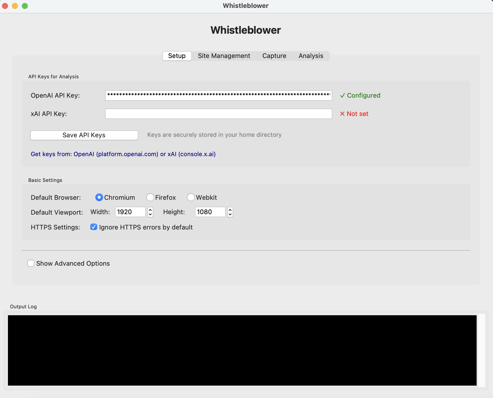
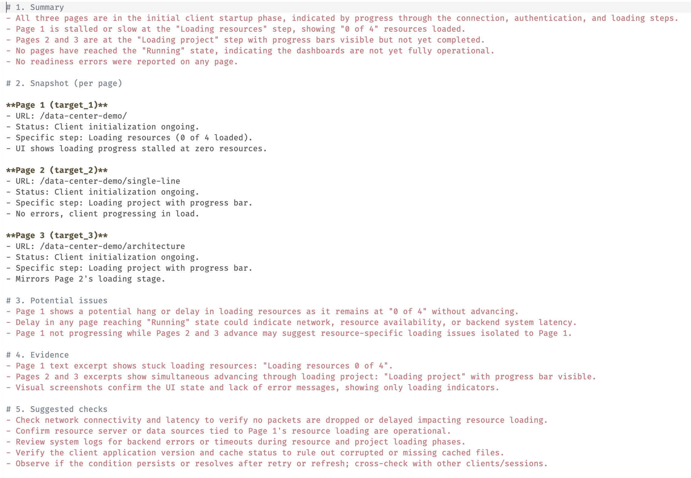

# Whistleblower

[](LICENSE)
[](https://www.python.org/)
[](#-quick-start)

> **Read-only evidence capture for any web-based control system.**

Whistleblower automatically logs into your building automation system (BAS), SCADA, or janky web dashboard, captures screenshots and data, and saves timestamped evidence locally.

**Perfect for:** Documenting what operators actually see, catching UI inconsistencies, and creating audit trails.

**100% Read-only.** No control actions, no vendor lock-in, no cloud required.

## 💡 Why This Exists

A couple weeks ago, I about a quality assurance tool to ensure the data preseneted to my users was consistent and correct. I wanted to ensure that my project didn't fall into the dirty little secret: **the data everyone trusts is usually wrong**. Graphics lie, APIs hide problems, and expensive analytics platforms charge you to analyze corrupted data. Before you can optimize anything, you need to verify what operators actually see on their screens matches reality.

**[Read my full rant: Are your graphics lying? →](docs/industry-lie.md)**

Whistleblower is the integrity check that should come first—capturing the presentation layer truth before feeding anything to analytics, AI, or decision-making systems.

---

## 🚀 Quick Start

### For Non-Technical Users (Recommended)

**Download the desktop application** - No Python or coding required!

#### Windows

1. **[📥 Download Whistleblower for Windows](https://github.com/makeitworkok/Whistleblower/releases/latest)** (47 MB)
2. Extract the ZIP file
3. Double-click `Whistleblower.exe`
4. Click "More info" → "Run anyway" if Windows warns you (this is normal for unsigned apps)

#### macOS

1. **[📥 Download Whistleblower for macOS](https://github.com/makeitworkok/Whistleblower/releases/latest)** (50 MB)
2. Open the DMG file and drag to Applications
3. Right-click the app → "Open" → "Open" again (first time only)

**What you'll be able to do:**

- ✅ Record login flows to your system (Bootstrap)
- ✅ Capture screenshots and data automatically
- ✅ Schedule regular captures (every 15 minutes, hourly, etc.)
- ✅ Analyze captures with AI (requires API key - see below)

### 🤖 AI Analysis (Optional but Recommended)

To get AI-powered analysis of your captures (detects anomalies, reads values, identifies issues), you'll need an **API key** from OpenAI or another provider.

**Getting an API Key (5 minutes):**

1. **OpenAI (Recommended for beginners):**
   - Visit: **[https://platform.openai.com/api-keys](https://platform.openai.com/api-keys)**
   - Sign up for an account (requires payment method)
   - Click "Create new secret key"
   - Copy the key (starts with `sk-...`)
   - Paste it into Whistleblower's "Analysis API Key" field
   - **Cost:** ~$0.01-0.05 per screenshot analyzed (very affordable)

2. **Alternative: xAI/Grok:**
   - Visit: **[https://console.x.ai/](https://console.x.ai/)**
   - Follow similar steps to get your API key

**Without an API key:** You can still capture screenshots and data - you just won't get automated analysis reports.

**📖 New to APIs?** See our [**API Key Guide**](docs/CLI-GUIDE.md#analysis-api-setup) for step-by-step instructions with screenshots.


*Configure your API keys and settings in the Setup tab*

---

## What Whistleblower Does

**Captures Evidence:**

- Automatically logs into your BAS/SCADA web interface
- Navigates to your dashboards and graphics
- Takes full-page screenshots
- Extracts visible data and element states
- Saves everything locally with timestamps

**AI Analysis (with API key):**

- Reads sensor values from screenshots
- Detects anomalies and unusual states
- Identifies potential issues
- Creates easy-to-read reports


*Example AI analysis report showing loading status and potential issues*

**🎭 AI Analysis Personalities (Advanced):**

Get specialized analysis from different professional perspectives! Enable one or more "personalities" to analyze your captures:

- **BoilerBob (Mechanical Authority)** - Examines mechanical equipment, pumps, boilers, chillers, and system status
- **ConservationCasey (Energy Specialist)** - Identifies energy waste, inefficiencies, and cost-saving opportunities
- **DirectorDave (ROI Strategist)** - Develops ROI models, calculates payback periods, and prioritizes improvements
- **GraphicalGary (UI Standards)** - Reviews interface consistency, usability, and graphical standards compliance


*Enable specialist AI personalities for targeted analysis of your building systems*

You can also ask custom questions like "What's the supply air temperature trend?" or "Are any pumps running in alarm?"

**What it does NOT do:**

- ❌ No setpoint changes or control actions (100% read-only)
- ❌ No vendor-specific protocols or APIs
- ❌ No cloud storage (everything stays local)
- ❌ No automatic alerts (yet)

---

## Supported Systems

Whistleblower works with **any web-based control system**. We provide ready-to-use templates for:

| Vendor | System | Status |
| -------- | -------- | -------- |
| **Tridium** | Niagara (N4) | ✅ Tested |
| **Trane** | Tracer Synchrony | ✅ Tested |
| **Generic** | React/SPA Systems | ✅ Tested |
| **Any Custom** | Web-based systems | ✅ Use Bootstrap Recorder |

**📖 Full vendor list:** [Supported Systems Guide](sites/README.md)

---

## For Developers

Want to run from source or customize? You'll need Python 3.12+.

<details>
<summary><strong>Click to expand developer setup</strong></summary>

### Installation

```bash
git clone https://github.com/makeitworkok/Whistleblower.git
cd Whistleblower
python3 -m pip install -r requirements.txt
python3 -m playwright install chromium
```

### Quick Run

```bash
# Use the desktop UI
python3 tkinter_ui_refactored.py

# Or run from command line
python3 whistleblower.py --config sites/example.json
```

### Advanced Documentation

- **[CLI Guide](docs/CLI-GUIDE.md)** - Command-line usage, analysis setup, advanced options
- **[Configuration Guide](sites/README.md)** - Creating site configs, templates, credentials
- **[React/SPA Systems](docs/REACTJS-GUIDE.md)** - Working with modern web frameworks
- **[Testing Guide](docs/TESTING.md)** - Validating configurations and running tests
- **[Build Guide](BUILD-GUIDE.md)** - Creating Windows/macOS executables

</details>

---

## 📁 What Gets Captured

After each run, you'll find timestamped folders with all the evidence:

```text
data/
└── my-building/
    └── 20260220-143000/          # Timestamp: Feb 20, 2026 at 2:30 PM
        ├── main_dashboard/
        │   ├── screenshot.png    # Full screenshot
        │   ├── dom.json         # Text and data from page
        │   ├── meta.json        # Run details
        │   └── analysis.md      # AI analysis (if you have API key)
        └── hvac_graphics/
            └── ...
```

Everything stays on your computer. Nothing is uploaded unless you explicitly run analysis.

---

## ⚠️ Important Notes

**Read-Only Access:** Configure your BAS account with **read-only permissions only**. Never give Whistleblower control or override rights.

**Unsigned Applications:** The desktop apps are not code-signed (this is an open-source educational project). Your OS will warn you the first time - this is normal and safe.

**API Costs:** If using AI analysis, OpenAI charges ~$0.01-0.05 per screenshot. Monitor your usage at [platform.openai.com](https://platform.openai.com/).

---

## 📚 Documentation

### Getting Started

- **[Desktop App User Guide](TKINTER-BUILD-GUIDE.md)** - Using the Windows/macOS applications
- **[Configuration Guide](sites/README.md)** - Setting up your first system
- **[Supported Systems](sites/README.md#supported-vendors)** - Vendor templates and examples

### Advanced Topics

- **[CLI Guide](docs/CLI-GUIDE.md)** - Command-line usage and automation
- **[React/SPA Systems](docs/REACTJS-GUIDE.md)** - Modern web frameworks (React, Vue, Angular)
- **[Testing & Validation](docs/TESTING.md)** - Test configs before deployment
- **[Build from Source](BUILD-GUIDE.md)** - Create your own executables

### Reference

- **[Roadmap](docs/ROADMAP.md)** - Planned features and improvements
- **[Changelog](docs/CHANGELOG.md)** - Version history
- **[Release Notes](RELEASE_NOTES_v1.0.0.md)** - v1.0.0 details

---

## 🤝 Contributing & Support

**Questions or issues?** [Open an issue on GitHub](https://github.com/makeitworkok/Whistleblower/issues)

**Want to contribute?** Pull requests are welcome! See [CODE_OF_CONDUCT.md](CODE_OF_CONDUCT.md)

---

## License

Whistleblower is released under the **MIT License**.

You are free to use, modify, and distribute this software for any purpose, including commercial use, without restriction. See [LICENSE](./LICENSE) for the full license text.

Contributions welcome.
